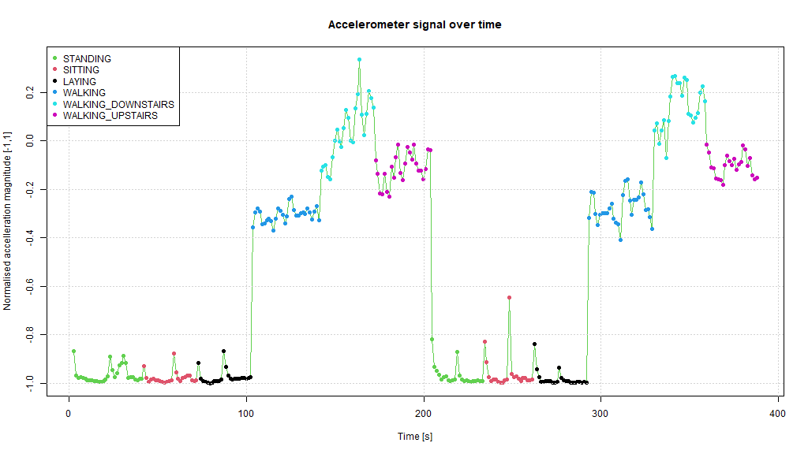

# Peer-graded Assignment: Getting and Cleaning Data Course Project

The purpose of this project is to demonstrate your ability to collect, work 
with, and clean a data set. The goal is to prepare tidy data that can be used 
for later analysis. 

## Objectives

One R script called `run_analysis.r` should be created that does the following:

1. Merges the training and the test sets to create one data set;
2. Extracts only the measurements on the mean and standard deviation for each
measurement;
3. Uses descriptive activity names to name the activities in the data set;
4. Appropriately labels the data set with descriptive variable names;
5. From the data set in step 4, creates a second, independent tidy data set with
the average of each variable for each activity and each subject.
   
## How to use

There is one main script performing all the required operations named, as per 
objectives, `run_analysis.r`. The script expects the working directory to be
already set to its same location. If this is not the case, update the R working
directory issuing command:

```
setwd("<path-to-script's-directory/folder>")
```

All sourced and saved data is placed in the `data` sub-folder, where the 
original dataset `samsung-sensors-data.zip` can be found. This file can safely 
be removed as the script will try to re-download it if not available. The 
script will save in the same folder the output of the analysis, namely:

* `tbl_tidy_1/` Data set and CodeBook resulting from Step 4;
* `tbl_tidy_2/` Data set and CodeBook resulting from Step 5.

## Results 

As an example, the script generates the plot presented in the following figure 
to show how the data from `tbl_tidy_1` can be exploited.



The CodeBooks are automatically generated by the script, still they are 
committed in this repository to ease their use (See )
[CodeBook: TBL TIDY 1](data/tbl_tidy_1/CodeBook.md) and
[CodeBook: TBL TIDY 2](data/tbl_tidy_2/CodeBook.md)
