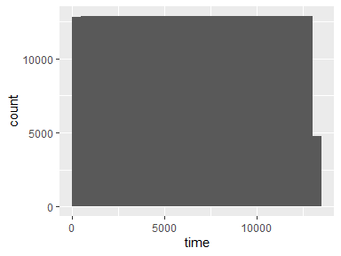
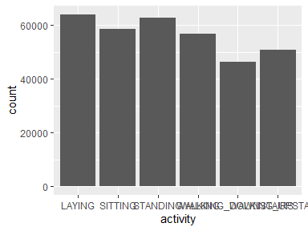
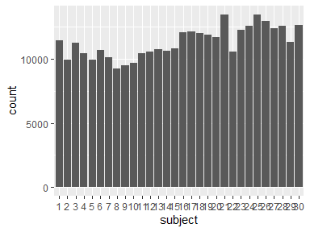
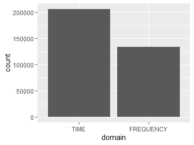
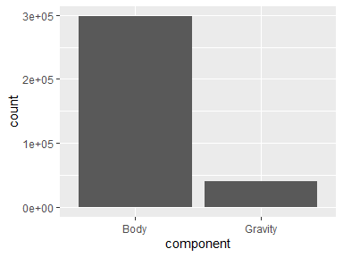
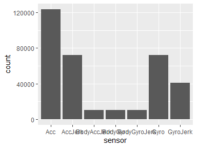
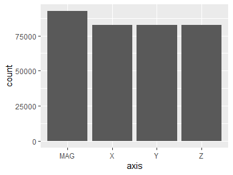
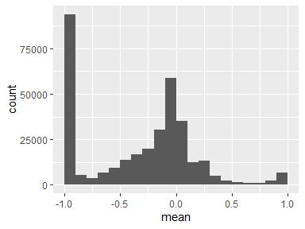
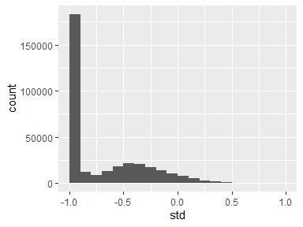

tbl_tidy_1
================
2021-12-17 17:58:19

# Data report overview

The dataset examined has the following dimensions:

| Feature                | Result |
|:-----------------------|-------:|
| Number of observations | 339867 |
| Number of variables    |      9 |

### Checks performed

The following variable checks were performed, depending on the data type
of each variable:

|                                                     | character | factor | labelled | haven labelled | numeric | integer | logical | Date |
|:----------------------------------------------------|:---------:|:------:|:--------:|:--------------:|:-------:|:-------:|:-------:|:----:|
| Identify miscoded missing values                    |     ×     |   ×    |    ×     |       ×        |    ×    |    ×    |         |  ×   |
| Identify prefixed and suffixed whitespace           |     ×     |   ×    |    ×     |       ×        |         |         |         |      |
| Identify levels with \< 6 obs.                      |     ×     |   ×    |    ×     |       ×        |         |         |         |      |
| Identify case issues                                |     ×     |   ×    |    ×     |       ×        |         |         |         |      |
| Identify misclassified numeric or integer variables |     ×     |   ×    |    ×     |       ×        |         |         |         |      |
| Identify outliers                                   |           |        |          |                |    ×    |    ×    |         |  ×   |

Please note that all numerical values in the following have been rounded
to 2 decimals.

# Codebook summary table

| Label                               | Variable                    | Class   | # unique values | Missing | Description                                                                                                                                                                                                                                                                                                                                                |
|:------------------------------------|:----------------------------|:--------|----------------:|:-------:|:-----------------------------------------------------------------------------------------------------------------------------------------------------------------------------------------------------------------------------------------------------------------------------------------------------------------------------------------------------------|
| Timestamp of last window sample     | **[time](#time)**           | numeric |           10299 | 0.00 %  | The ‘time’ column provides the riconstructed information about the time the variable is computed. This information is only indirectly available in the original data set, where time domain signals were captured at a constant rate of 50 Hz (20 ms period) and sampled in fixed-width sliding windows of 2.56 sec and 50% overlap (128 readings/window). |
| Activity performed by the person    | **[activity](#activity)**   | factor  |               6 | 0.00 %  | Each person performed six activities (WALKING, WALKING_UPSTAIRS, WALKING_DOWNSTAIRS, SITTING, STANDING, LAYING). The experiments have been video-recorded to label the data manually.                                                                                                                                                                      |
| Person performing the activity      | **[subject](#subject)**     | factor  |              30 | 0.00 %  | A group of 30 volunteers within an age bracket of 19-48 years carried out the experiments.                                                                                                                                                                                                                                                                 |
| Physical domain of the variable     | **[domain](#domain)**       | factor  |               2 | 0.00 %  | From each window, a vector of features was obtained by calculating variables either from the time or frequency domain.                                                                                                                                                                                                                                     |
| Physical domain of the variable     | **[component](#component)** | factor  |               2 | 0.00 %  | The sensor acceleration signals have gravitational and body motion components, separated using a Butterworth low-pass filter into body acceleration and gravity. The gravitational force is assumed to have only low frequency components, therefore a filter with 0.3 Hz cutoff frequency was used. Gyroscope signals have only body motion component.    |
| Embedded accelerometer or gyroscope | **[sensor](#sensor)**       | factor  |               7 | 0.00 %  | Linear acceleration and angular velocity are captured using a smartphone’s embedded accelerometer and gyroscope sensors. The body linear acceleration and angular velocity were derived in time to obtain Jerk signals.                                                                                                                                    |
| 3-axial signals                     | **[axis](#axis)**           | factor  |               4 | 0.00 %  | 3-axial linear acceleration and 3-axial angular velocity are captured. Also the magnitude of these three-dimensional signals were calculated using the Euclidean norm.                                                                                                                                                                                     |
| Mean value                          | **[mean](#mean)**           | numeric |          328332 | 0.00 %  | Mean value normalized and bounded within \[-1,1\], estimated from the 3-axial linear acceleration and 3-axial angular velocity signals.                                                                                                                                                                                                                    |
| Standard deviation                  | **[std](#std)**             | numeric |          325489 | 0.00 %  | Standard deviation normalized and bounded within \[-1,1\], estimated from the 3-axial linear acceleration and 3-axial angular velocity signals.                                                                                                                                                                                                            |

# Variable list

## time

*Timestamp of last window sample*

| Feature                 |           Result |
|:------------------------|-----------------:|
| Variable type           |          numeric |
| Number of missing obs.  |          0 (0 %) |
| Number of unique values |            10299 |
| Median                  |          6593.28 |
| 1st and 3rd quartiles   | 3297.28; 9889.28 |
| Min. and max.           |      2.56; 13184 |

<!-- -->

------------------------------------------------------------------------

## activity

*Activity performed by the person*

| Feature                 |   Result |
|:------------------------|---------:|
| Variable type           |   factor |
| Number of missing obs.  |  0 (0 %) |
| Number of unique values |        6 |
| Mode                    | “LAYING” |
| Reference category      |   LAYING |

<!-- -->

------------------------------------------------------------------------

## subject

*Person performing the activity*

| Feature                 |  Result |
|:------------------------|--------:|
| Variable type           |  factor |
| Number of missing obs.  | 0 (0 %) |
| Number of unique values |      30 |
| Mode                    |    “25” |
| Reference category      |       1 |

<!-- -->

-   Note: The variable consists exclusively of numbers and takes a lot
    of different values. Is it perhaps a misclassified numeric variable?

------------------------------------------------------------------------

## domain

*Physical domain of the variable*

| Feature                 |  Result |
|:------------------------|--------:|
| Variable type           |  factor |
| Number of missing obs.  | 0 (0 %) |
| Number of unique values |       2 |
| Mode                    |  “TIME” |
| Reference category      |    TIME |

<!-- -->

------------------------------------------------------------------------

## component

*Physical domain of the variable*

| Feature                 |  Result |
|:------------------------|--------:|
| Variable type           |  factor |
| Number of missing obs.  | 0 (0 %) |
| Number of unique values |       2 |
| Mode                    |  “Body” |
| Reference category      |    Body |

<!-- -->

------------------------------------------------------------------------

## sensor

*Embedded accelerometer or gyroscope*

| Feature                 |  Result |
|:------------------------|--------:|
| Variable type           |  factor |
| Number of missing obs.  | 0 (0 %) |
| Number of unique values |       7 |
| Mode                    |   “Acc” |
| Reference category      |     Acc |

<!-- -->

------------------------------------------------------------------------

## axis

*3-axial signals*

| Feature                 |  Result |
|:------------------------|--------:|
| Variable type           |  factor |
| Number of missing obs.  | 0 (0 %) |
| Number of unique values |       4 |
| Mode                    |   “MAG” |
| Reference category      |     MAG |

<!-- -->

------------------------------------------------------------------------

## mean

*Mean value*

| Feature                 |       Result |
|:------------------------|-------------:|
| Variable type           |      numeric |
| Number of missing obs.  |      0 (0 %) |
| Number of unique values |       328332 |
| Median                  |         -0.2 |
| 1st and 3rd quartiles   | -0.95; -0.01 |
| Min. and max.           |        -1; 1 |

<!-- -->

-   Note that the following possible outlier values were detected:
    "0.24", "0.24", "0.24", "0.24", "0.24", …, "1", "1", "1", "1", "1"
    (29749 values omitted).

------------------------------------------------------------------------

## std

*Standard deviation*

| Feature                 |       Result |
|:------------------------|-------------:|
| Variable type           |      numeric |
| Number of missing obs.  |      0 (0 %) |
| Number of unique values |       325489 |
| Median                  |        -0.94 |
| 1st and 3rd quartiles   | -0.99; -0.41 |
| Min. and max.           |        -1; 1 |

<!-- -->

------------------------------------------------------------------------

Report generation information:

-   Created by: eZeTec (username: `eZe`).

-   Report creation time: Fri Dec 17 2021 17:58:41

-   Report was run from directory: `E:/@projects/ProgrammingAssignment3`

-   dataReporter v1.0.2 \[Pkg: 2021-11-11 from CRAN (R 4.1.2)\]

-   R version 4.1.2 (2021-11-01).

-   Platform: x86_64-w64-mingw32/x64 (64-bit)(Windows 10 x64 (build
    22000)).

-   Function call:
    `makeDataReport(data = eval(parse(text = table_name)), render = F,      mode = c("summarize", "visualize", "check"), smartNum = F,      file = rmd_file_path, replace = T, openResult = F, codebook = T,      reportTitle = table_name)`
