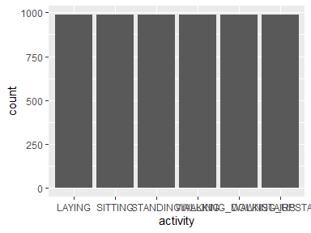
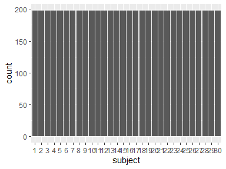
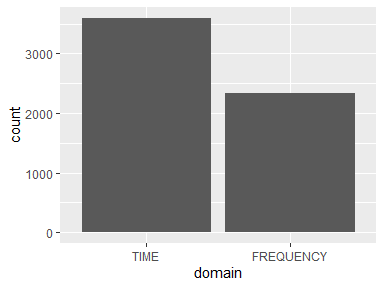
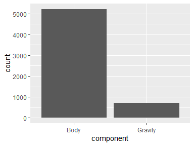
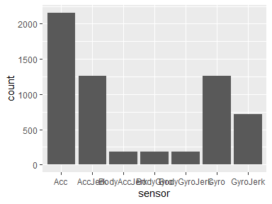
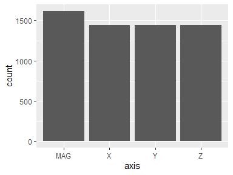
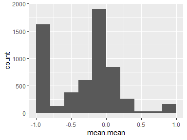
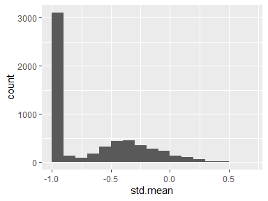

tbl_tidy_2
================
2021-12-17 17:58:55

# Data report overview

The dataset examined has the following dimensions:

| Feature                | Result |
|:-----------------------|-------:|
| Number of observations |   5940 |
| Number of variables    |      8 |

### Checks performed

The following variable checks were performed, depending on the data type
of each variable:

|                                                     | character | factor | labelled | haven labelled | numeric | integer | logical | Date |
|:----------------------------------------------------|:---------:|:------:|:--------:|:--------------:|:-------:|:-------:|:-------:|:----:|
| Identify miscoded missing values                    |     ×     |   ×    |    ×     |       ×        |    ×    |    ×    |         |  ×   |
| Identify prefixed and suffixed whitespace           |     ×     |   ×    |    ×     |       ×        |         |         |         |      |
| Identify levels with \< 6 obs.                      |     ×     |   ×    |    ×     |       ×        |         |         |         |      |
| Identify case issues                                |     ×     |   ×    |    ×     |       ×        |         |         |         |      |
| Identify misclassified numeric or integer variables |     ×     |   ×    |    ×     |       ×        |         |         |         |      |
| Identify outliers                                   |           |        |          |                |    ×    |    ×    |         |  ×   |

Please note that all numerical values in the following have been rounded
to 2 decimals.

# Codebook summary table

| Label                                    | Variable                    | Class   | # unique values | Missing | Description                                                                                                                                                                                                                                                                                                                                             |
|:-----------------------------------------|:----------------------------|:--------|----------------:|:-------:|:--------------------------------------------------------------------------------------------------------------------------------------------------------------------------------------------------------------------------------------------------------------------------------------------------------------------------------------------------------|
| Activity performed by the person         | **[activity](#activity)**   | factor  |               6 | 0.00 %  | Each person performed six activities (WALKING, WALKING_UPSTAIRS, WALKING_DOWNSTAIRS, SITTING, STANDING, LAYING). The experiments have been video-recorded to label the data manually.                                                                                                                                                                   |
| Person performing the activity           | **[subject](#subject)**     | factor  |              30 | 0.00 %  | A group of 30 volunteers within an age bracket of 19-48 years carried out the experiments.                                                                                                                                                                                                                                                              |
| Physical domain of the variable          | **[domain](#domain)**       | factor  |               2 | 0.00 %  | From each window, a vector of features was obtained by calculating variables either from the time or frequency domain.                                                                                                                                                                                                                                  |
| Physical domain of the variable          | **[component](#component)** | factor  |               2 | 0.00 %  | The sensor acceleration signals have gravitational and body motion components, separated using a Butterworth low-pass filter into body acceleration and gravity. The gravitational force is assumed to have only low frequency components, therefore a filter with 0.3 Hz cutoff frequency was used. Gyroscope signals have only body motion component. |
| Embedded accelerometer or gyroscope      | **[sensor](#sensor)**       | factor  |               7 | 0.00 %  | Linear acceleration and angular velocity are captured using a smartphone’s embedded accelerometer and gyroscope sensors. The body linear acceleration and angular velocity were derived in time to obtain Jerk signals.                                                                                                                                 |
| 3-axial signals                          | **[axis](#axis)**           | factor  |               4 | 0.00 %  | 3-axial linear acceleration and 3-axial angular velocity are captured. Also the magnitude of these three-dimensional signals were calculated using the Euclidean norm.                                                                                                                                                                                  |
| Mean of the data windows’ mean over time | **[mean.mean](#mean.mean)** | numeric |            5760 | 0.00 %  | Mean value normalized and bounded within \[-1,1\], estimated from the 3-axial linear acceleration and 3-axial angular velocity signals.                                                                                                                                                                                                                 |
| Mean of the data windows’ std over time  | **[std.mean](#std.mean)**   | numeric |            5760 | 0.00 %  | Standard deviation normalized and bounded within \[-1,1\], estimated from the 3-axial linear acceleration and 3-axial angular velocity signals.                                                                                                                                                                                                         |

# Variable list

## activity

*Activity performed by the person*

| Feature                 |   Result |
|:------------------------|---------:|
| Variable type           |   factor |
| Number of missing obs.  |  0 (0 %) |
| Number of unique values |        6 |
| Mode                    | “LAYING” |
| Reference category      |   LAYING |

<!-- -->

------------------------------------------------------------------------

## subject

*Person performing the activity*

| Feature                 |  Result |
|:------------------------|--------:|
| Variable type           |  factor |
| Number of missing obs.  | 0 (0 %) |
| Number of unique values |      30 |
| Mode                    |     “1” |
| Reference category      |       1 |

<!-- -->

-   Note: The variable consists exclusively of numbers and takes a lot
    of different values. Is it perhaps a misclassified numeric variable?

------------------------------------------------------------------------

## domain

*Physical domain of the variable*

| Feature                 |  Result |
|:------------------------|--------:|
| Variable type           |  factor |
| Number of missing obs.  | 0 (0 %) |
| Number of unique values |       2 |
| Mode                    |  “TIME” |
| Reference category      |    TIME |

<!-- -->

------------------------------------------------------------------------

## component

*Physical domain of the variable*

| Feature                 |  Result |
|:------------------------|--------:|
| Variable type           |  factor |
| Number of missing obs.  | 0 (0 %) |
| Number of unique values |       2 |
| Mode                    |  “Body” |
| Reference category      |    Body |

<!-- -->

------------------------------------------------------------------------

## sensor

*Embedded accelerometer or gyroscope*

| Feature                 |  Result |
|:------------------------|--------:|
| Variable type           |  factor |
| Number of missing obs.  | 0 (0 %) |
| Number of unique values |       7 |
| Mode                    |   “Acc” |
| Reference category      |     Acc |

<!-- -->

------------------------------------------------------------------------

## axis

*3-axial signals*

| Feature                 |  Result |
|:------------------------|--------:|
| Variable type           |  factor |
| Number of missing obs.  | 0 (0 %) |
| Number of unique values |       4 |
| Mode                    |   “MAG” |
| Reference category      |     MAG |

<!-- -->

------------------------------------------------------------------------

## mean.mean

*Mean of the data windows’ mean over time*

| Feature                 |       Result |
|:------------------------|-------------:|
| Variable type           |      numeric |
| Number of missing obs.  |      0 (0 %) |
| Number of unique values |         5760 |
| Median                  |        -0.13 |
| 1st and 3rd quartiles   | -0.93; -0.01 |
| Min. and max.           |     -1; 0.97 |

<!-- -->

-   Note that the following possible outlier values were detected:
    "0.12", "0.12", "0.12", "0.12", "0.12", …, "0.97", "0.97", "0.97",
    "0.97", "0.97" (566 values omitted).

------------------------------------------------------------------------

## std.mean

*Mean of the data windows’ std over time*

| Feature                 |       Result |
|:------------------------|-------------:|
| Variable type           |      numeric |
| Number of missing obs.  |      0 (0 %) |
| Number of unique values |         5760 |
| Median                  |        -0.92 |
| 1st and 3rd quartiles   | -0.97; -0.36 |
| Min. and max.           |     -1; 0.69 |

<!-- -->

------------------------------------------------------------------------

Report generation information:

-   Created by: eZeTec (username: `eZe`).

-   Report creation time: Fri Dec 17 2021 17:58:57

-   Report was run from directory: `E:/@projects/ProgrammingAssignment3`

-   dataReporter v1.0.2 \[Pkg: 2021-11-11 from CRAN (R 4.1.2)\]

-   R version 4.1.2 (2021-11-01).

-   Platform: x86_64-w64-mingw32/x64 (64-bit)(Windows 10 x64 (build
    22000)).

-   Function call:
    `makeDataReport(data = eval(parse(text = table_name)), render = F,      mode = c("summarize", "visualize", "check"), smartNum = F,      file = rmd_file_path, replace = T, openResult = F, codebook = T,      reportTitle = table_name)`
